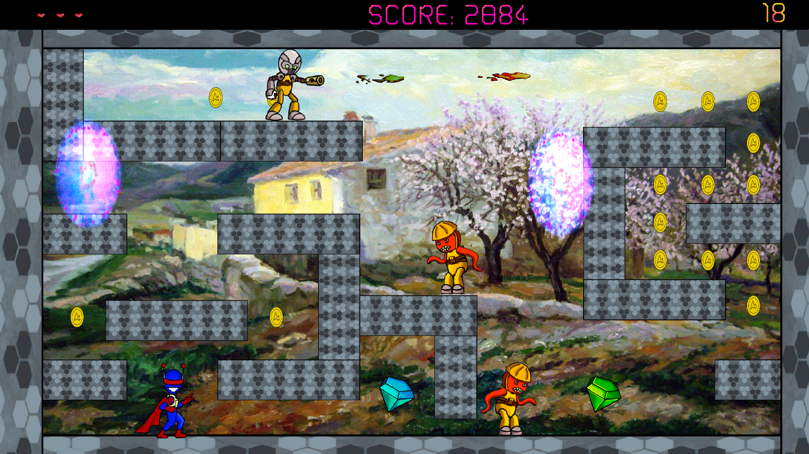
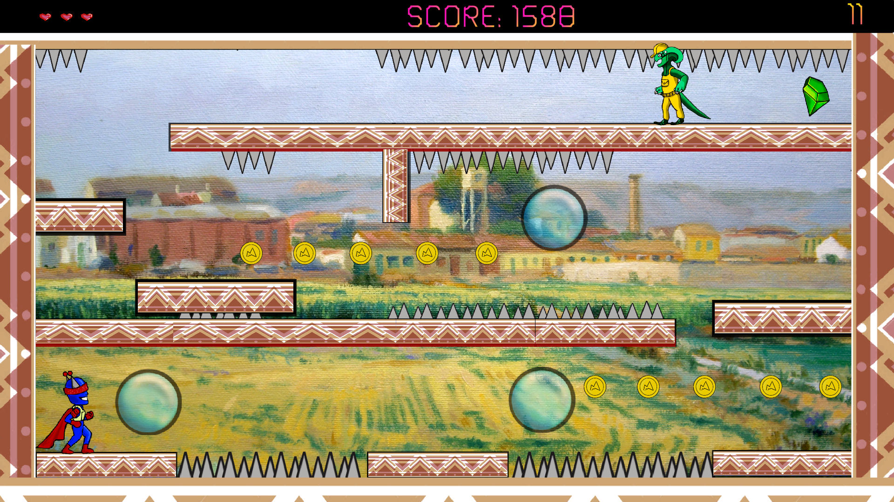
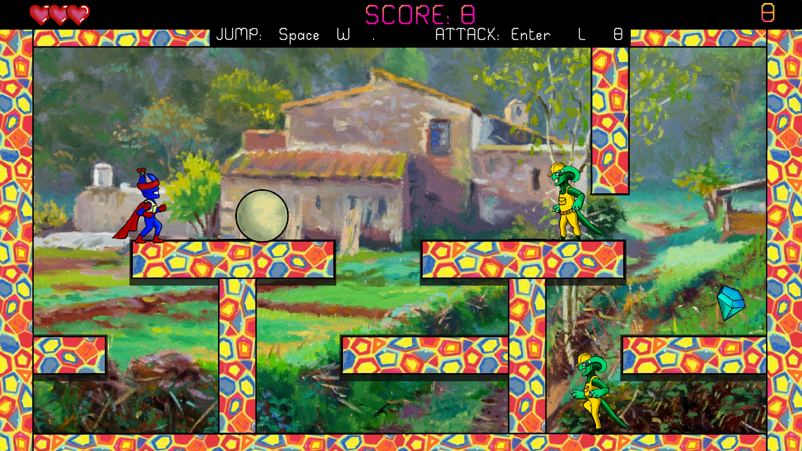
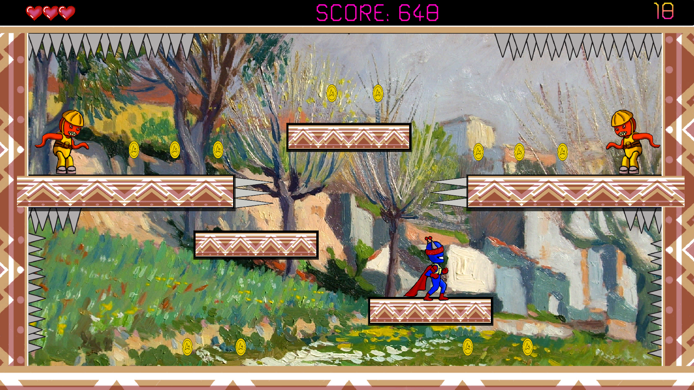
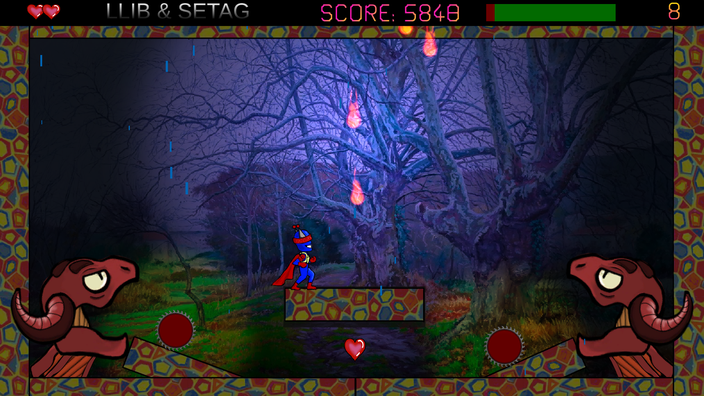
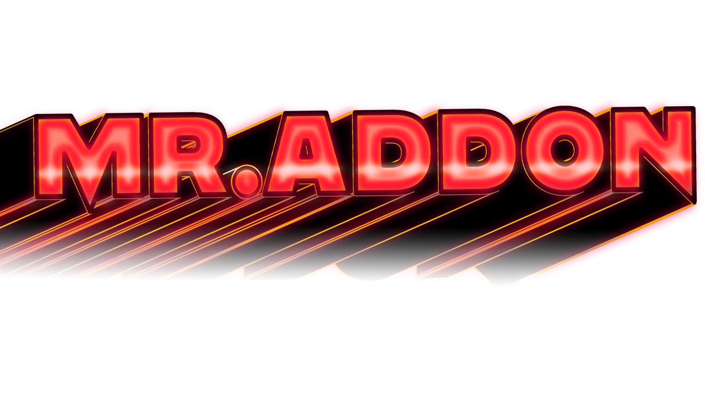

# Mr.Addon-in-Sulpicius-Gallus-M-Game

Mr.Addon in Sulpicius Gallus M Game Arcade Platform and Puzzle type Snow Bros. FREE for PC & Android. See more in [license.txt](license.txt) file. See ["Releases"](https://github.com/Add0nius/Mr.Addon-in-Sulpicius-Gallus-M-Game/releases) section in GitHub repository to download the installables. Links:
- [Addonius Website](https://www.addonius.com/)
- [FREE in Microsoft Store](https://apps.microsoft.com/detail/9pmx4hs7dpm4?hl=en-us&gl=US)
- [FREE in Google Play Store](https://play.google.com/store/apps/details?id=com.Flauros.Mr.Addon)
- [FREE in Steam](https://store.steampowered.com/app/1819630/MrAddon_in_Sulpicius_Gallus_M/)
- [FREE in Itch.io](https://addonius.itch.io/mraddon-in-sulpicius-gallus-m)

Mr.Addon is a cosmic renegade who has come to a section of the Sulpicius Gallus M crater to help awaken the "Big Human" who remains asleep within. He accompanies Mr. Addon on this not-for-the-faint adventure, where he will battle system maintenance technicians, Dominion aliens, and replicating cyborgs. Use your powers to bring together what is above and what is below by turning your enemies into exploding moons! Complete the 3 levels in a row and kill their 3 final bosses. Use the elements, ice, fire, teleportation portals and solve the “sharp” puzzles of this adventure, while you enjoy viewing the pictorial work of Peláez Ochoa and the musical work of unTIL BEN. Are you coming with Mr. Addon to the Moon?

Regarding the gameplay, MrAddon is an incredible 2D platform game, whose mechanics consists of eliminating all the enemies in each level, as well as a boss that is at the end of each world for 3 worlds. Being able to play in an "Arcade" mode or in the "Level Selection" mode. The game cannot be saved and the "continues" are limited. The difficulty increases as the game progresses, mainly due to the dangerousness of the enemies and the structure of the screen, where many times you have to find out the best way to solve the level. To eliminate all the enemies of the level, it is achieved by throwing them multi-frequency "rainbow" rays, which is the special ability of the MrAddon character, thus turning them into "Moons", "Snow balls" or "Fire balls" and then rolling them to eliminate more enemies. An adventure created by fans of the mythical Arcade game Snow Bros.

